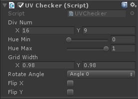
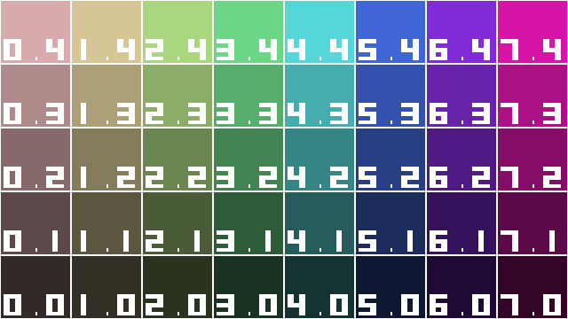
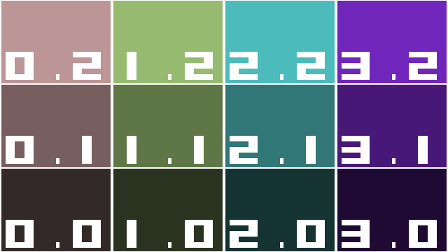
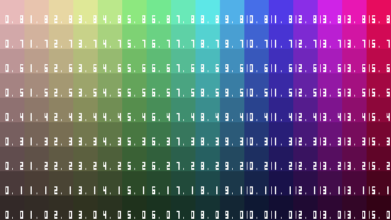

# UnityUVCheckerImageEffect
Image effect of UV Check pattern for Unity3D

- Only fragment shader graphics!(Not use texture resource)
- Customizable subdivision number
- Customizable Color Hue
- Customizable Grid line width
- Customizable rotate angle (90 degrees unit)
- Customizable X / Y Flip

